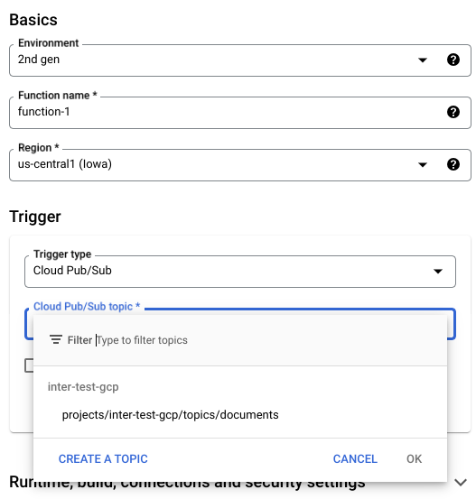
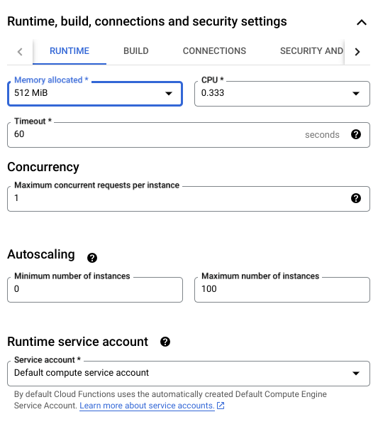
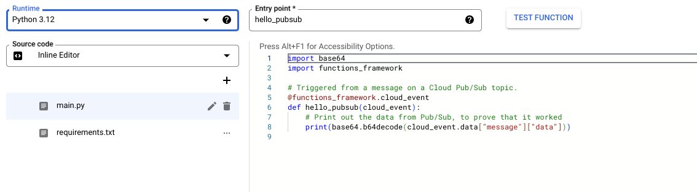

# interproteccion-resident
Repository for examples for interproteccion engagement

## Trigger Cloud Function 

To trigger the analysis of files, once the file has been uploaded to a bucket the following APIs need to be enabled.

1. Pub/Sub
2. Cloud Functions
3. Cloud Storage
4. Vertex AI
5. Firestore
6. Firebase

### Create the required resources

1. Create Firestore database [link](https://cloud.google.com/firestore/docs/create-database-server-client-library#create_a_in_native_mode_database)
2. Create Pub Sub topic
   ```bash
    TOPIC_NAME="documents" 
    gcloud pubsub topics create $TOPIC_NAME    
   ```
3. Add notifications to the bucket created in step 2.
   ```bash
    BUCKET_NAME="bucket-up-app"

    gcloud storage buckets notifications create gs://$BUCKET_NAME --topic=$TOPIC_NAME    
   ```
4. Create Cloud function with [code](CF_upload_file/) and follow the next steps.
   - Select Trigger type as Pub/Sub
        
   - Increase the Mememory
        
   - Python code
        